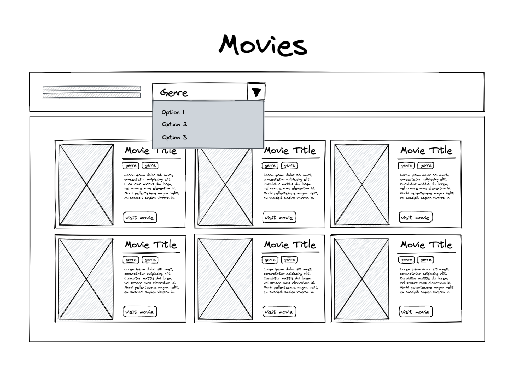

## Submission requirements:

In an email to the interviewer(s), please provide the following: 

1. a link to either a Github repo (or any other Git manager online service of your choice), or a CodePen (or any other online editor of your choice), where your submission can be seen/downloaded and tested in the browser. If your submission cannot be tested directly in the browser, please provide detail instructions on how to run it and display it in the browser.

2. a short rationale, where you can further expand on the logic and aesthetic decisions and/or highlight any notable aspects or challenges about your submission.

## Test details

The duration of this exercise may average between 4 to 5 hours.
Based on the below wireframe and the content provided in [content.json](./content.json),
__create a component where the user would be able to filter by movie genres and display the filtered movie information.__

 

### Noteworthy considerations:

- The filter, should contain all the movie genres listed in the details for each movie inside [content.json](./content.json) .
- Feel free to use the colour scheme and the font of your choice.
- Feel free to use transitions, animations, or hover effects.
- Feel free to use any external UI library.
- Feel free to use other images than the ones provided, if you wish to.
- Feel free to layout the card the way you see appropriate, you don't have to abide by the wireframe.
- The JSON file can be used however you find appropriate; as a reference to copy/paste the content or by itself to get the content.
- The submission should be free form visual and script errors, and a special attention needs to be given to UX best practices.
- The technologies you can use should involve, but not limited to: _HTML_, _CSS_, and _Javascript_.